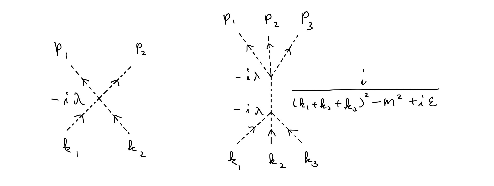

# 第2章 Feynmanダイアグラム

## 2.1 スカラー場の相互作用
前章では、相互作用をしない場、すなわち自由場を考えた。しかし、現実の粒子は相互に作用しあっている。場の理論が正しいと考えるなら、相互作用の形を予測して、そのような相互作用を入れたときの確率振幅を計算し、それが実験と合うかを調べることになる。

相互作用は場の演算子の適当な「関数」を積分したもので表されると考える。  
たとえば、スカラー場の「4点相互作用」とよばれるものは次のように書かれる。

　　\\(\lambda\displaystyle{\int}d^4x \phi(x)^4\\)

ここで、\\(\lambda\\) は相互作用の強さを表す定数である。これは「小さい量」と考える。そのため、まず自由場で考え、その補正としてこの相互作用をいれることができるわけである。

たとえば、前章に従えば、自由スカラー場の場合、\\(z\\)、\\(w\\) にあった2つの粒子が、\\(x\\)、\\(y\\) まで伝搬する確率振幅は、

　　\\(<0|T\phi(x)\phi(y)\phi(z)\phi(w)|0>\\)

を計算すればよかった。このような計算は前章の基本に戻って計算することもできるが、Wickの定理と呼ばれる簡単な計算法もある。いずれにしても、

　　\\(<0|T\phi(x)\phi(y)\phi(z)\phi(w)|0>\\)  
　　\\( = D_F(x - y)D_F(z - w) + D_F(x - z)D_F(y - w) + D_F(x - w)D_F(y - z)\\)

となる。これは、「1つの粒子の伝搬」の積たちである。ただし、どの組み合わせが「1つの粒子」になるかで3通りの組合せができているのである。

上記の4点相互作用が実際に起こった場合の確率振幅は

　　\\(<0|T\phi(x)\phi(y)\phi(z)\phi(w) (-i\lambda\displaystyle{\int}d^4u \phi(u)^4)|0>\\)

を計算することになる。  
「どうしてそう考えられるのか」にはより詳しい説明がある。しかし、いずれにしても、「そう考えてみて、実験で確かめる」という構図は変わらない。したがって、ここでは、上の形が正しいと仮定して進むことにする。

前章の自由場の演算子を上の表式に代入し計算すれば、「答」が出る。\\(\phi\\) には、\\(a_\mathbf{p}\\) たちと、\\(a_\mathbf{p}^+\\) たちが入っていた。\\(a_\mathbf{p}\\) パートは右の \\(|0>\\) に作用するとゼロになり、\\(a_\mathbf{p}^+\\) パートは左の \\(<0|\\) に作用する（触れる）とゼロになるのだった。そこで、上の式の中で、\\(a_\mathbf{p}\\) パートを右の方に、\\(a_\mathbf{p}^+\\) を左の方に動かしていき、それぞれ \\(|0>\\)、\\(<0|\\) に触れさせてゼロにする。ただし、\\(a_\mathbf{p}\\) と \\(a_\mathbf{p}^+\\) がすれ違うとき、すなわち交換するときに、交換子ができて、デルタ関数が現れる。

　　\\(a_\mathbf{p} a_{\mathbf{p}'}^+ = a_{\mathbf{p}'}^+ a_\mathbf{p} + [a_\mathbf{p} , a_{\mathbf{p}'}^+] = a_\mathbf{p}^+ a_\mathbf{p} + (2\pi)^3\delta^{(3)}(\mathbf{p} - \mathbf{p}')\\) 

これを使って計算すると、

　　\\(<0|T\phi(x)\phi(y)\phi(z)\phi(w) (-i\lambda\displaystyle{\int}d^4u \phi(u)^4)|0>\\)  
　　\\(　 = -4!i\lambda\displaystyle{\int}d^4uD_F(x-u)D_F(y-u)D_F(z-u)D_F(w-u)\\)

となる。

これは、4点関数などとよばれるものだが、たとえば、\\(z\\)、\\(w\\) の時刻を \\(x\\)、\\(y\\) の時刻より前に取れば、「\\(z\\)、\\(w\\) にあった2つの粒子が、\\(x\\)、\\(y\\) まで伝搬する確率振幅」と言うべきものである。その答えは簡単で、「1つの粒子の伝搬」を表す \\(D_F\\) 部分を除くと、\\(-4! i\lambda\\) のみである。しかも、\\(4!\\) は、\\(\\phi(x)\\)、\\(\\phi(y)\\)、\\(\\phi(z)\\)、\\(\\phi(w)\\) のどれが、相互作用項の4つの \\(\phi(u)\\) のどれに流れ込むかの組合せによりでてくる係数である。

\\(\phi(x)\\) には無数の運動量の状態が重ね合わさって入っているのだった。実際に実験を行う際には、入射する粒子の運動量は決められていると考えることができる。また、射出される粒子の運動量も計測し決定することができる。そこで、\\(\phi\\) たちの中で、知りたい場合の運動量の項だけを選り出して計算すれば、その場合の確率振幅が求まるわけである。 

そのように始状態と終状態を粒子たちの運動量で指定して、その現象が起こる確率（散乱断面積という言葉で表される）を出すことができる。しかし、そのためには物理計算としては普通だがとても長い計算がある（運動学Kinematicsとよばれる）。さらに、「計算すると答が発散する（無限大になる）」という場の理論の「難しさ」がすでに見えてきて、そこには一定の解釈が必要になる。たとえば、それは「粒子がいつでも相互作用できるのなら、相互作用前の始状態や相互作用後の終状態をどう切り出せばよいのか」などという問題になる。

とは言え、（普通の）物理学者はその解釈に同意している。そこで、ここでは実践でも使える公式までは導かないが、その中心部分は上記の4点関数であるということを指摘するのみとする。  
上の4点関数に \\(D_F\\) の運動量を使った表記を入れ、始状態の2つの粒子の運動量を \\(k_1\\)、\\(k_2\\)、終状態のの2つの粒子の運動量を \\(p_1\\)、\\(p_2\\) とし、\\(u\\) の積分の際に、公式

　　\\(\displaystyle{\int}dxe^{-ipx} = 2\pi\delta(p)\\)

を使うと、4点関数は

　　\\(-4!i\lambda(2\pi)^4\delta^{(4)}(p_1 + p_2 - k_1 - k_2)\\)  
　　　　　\\(×\displaystyle{\frac{i}{p_1^2 - m^2}\frac{i}{p_2^2 - m^2}\frac{i}{k_1^2 - m^2}\frac{i}{k_2^2 - m^2}}e^{-ip_1x}e^{-ip_2y}e^{ik_1z}e^{ik_2w}\\)

となる。

この現象（2つの粒子が入射し2つ粒子が射出される）が起こる確率を計算する際に必要となる部分は \\(-4!i\lambda\\) のみなのである（それを示すのが長いので省略すると書いた）。これは実質的に、相互作用項の係数なので「当たり前」に見えるが、もう少し複雑な場合、たとえば、6点関数を考えると意味がわかると思う。

4点相互作用をするスカラー場では、3つの粒子が入射し、3つの粒子が射出されることが起る。もちろん、粒子が相互作用せずに素通りするならそうなるはずだが、そのような自明な場合は考えないとして、である。その確率を出すための本質的部分は、6点関数

　　\\(<0|T\phi(x_1)\phi(x_2)\phi(x_3)\phi(x_4)\phi(x_5)\phi(x_6)\\)  
　　　　　　　　　\\(\frac{1}{2}(-i\lambda\displaystyle{\int}d^4u \phi(u)^4)(-i\lambda\displaystyle{\int}d^4v \phi(v)^4)|0>\\)  

から、4点関数のときと同様に出すことができる。

結果を書くと次のようになる。

　　\\(\displaystyle{(-i\lambda)^2 \frac{i}{(k_1 + k_2 + k_3)^2 - m^2 + i\epsilon}} + \cdots\\)
 
「\\(\cdots\\)」は、\\(k_1 , \cdots , p_2\\) の役割を替えた項を表す。  
運動量の保存則より、

　　\\(k_1 + k_2 + k_3 = p_1 + p_2 + p_3\\)

ただし、運動量 \\(p\\) の粒子の伝搬は \\(\frac{i}{p^2 - m^2 + i\epsilon}\\) であった。それも含めて、これまでにでてきた4点関数、6点関数は、次のように図で表すことができる。

